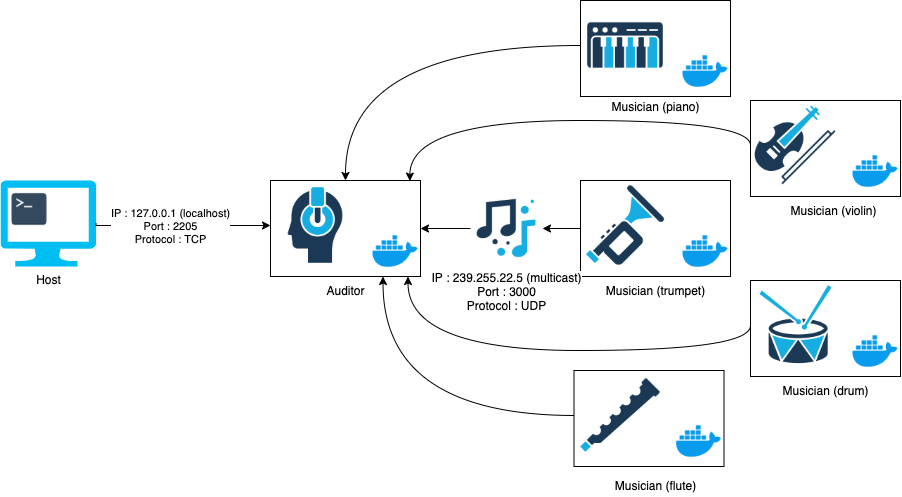
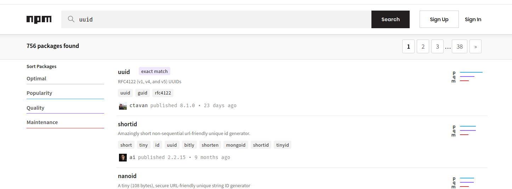
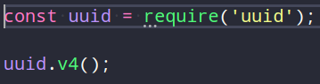
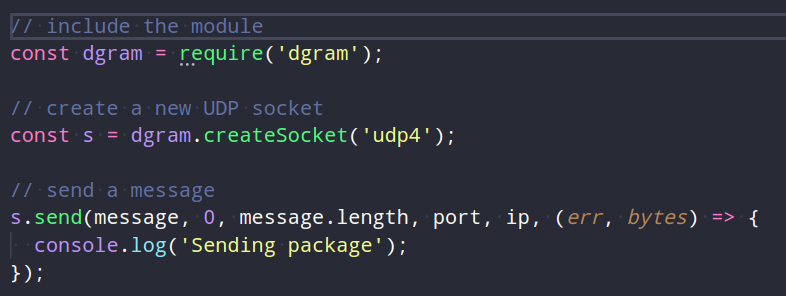
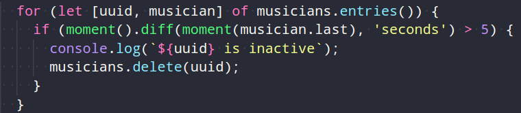
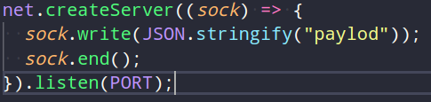
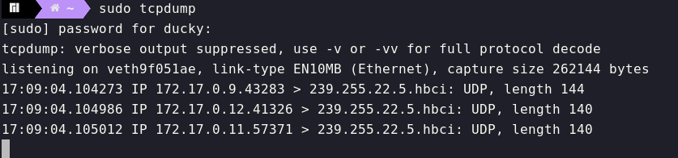

# Teaching-HEIGVD-RES-2020-Labo-Orchestra

## Admin

* **You can work in groups of 2 students**.
* It is up to you if you want to fork this repo, or if you prefer to work in a private repo. However, you have to **use exactly the same directory structure for the validation procedure to work**. 
* We expect that you will have more issues and questions than with other labs (because we have a left some questions open on purpose). Please ask your questions on Telegram / Teams, so that everyone in the class can benefit from the discussion.

## Objectives

This lab has 4 objectives:

* The first objective is to **design and implement a simple application protocol on top of UDP**. It will be very similar to the protocol presented during the lecture (where thermometers were publishing temperature events in a multicast group and where a station was listening for these events).

* The second objective is to get familiar with several tools from **the JavaScript ecosystem**. You will implement two simple **Node.js** applications. You will also have to search for and use a couple of **npm modules** (i.e. third-party libraries).

* The third objective is to continue practicing with **Docker**. You will have to create 2 Docker images (they will be very similar to the images presented in class). You will then have to run multiple containers based on these images.

* Last but not least, the fourth objective is to **work with a bit less upfront guidance**, as compared with previous labs. This time, we do not provide a complete webcast to get you started, because we want you to search for information (this is a very important skill that we will increasingly train). Don't worry, we have prepared a fairly detailed list of tasks that will put you on the right track. If you feel a bit overwhelmed at the beginning, make sure to read this document carefully and to find answers to the questions asked in the tables. You will see that the whole thing will become more and more approachable.


## Requirements

In this lab, you will **write 2 small NodeJS applications** and **package them in Docker images**:

* the first app, **Musician**, simulates someone who plays an instrument in an orchestra. When the app is started, it is assigned an instrument (piano, flute, etc.). As long as it is running, every second it will emit a sound (well... simulate the emission of a sound: we are talking about a communication protocol). Of course, the sound depends on the instrument.

* the second app, **Auditor**, simulates someone who listens to the orchestra. This application has two responsibilities. Firstly, it must listen to Musicians and keep track of **active** musicians. A musician is active if it has played a sound during the last 5 seconds. Secondly, it must make this information available to you. Concretely, this means that it should implement a very simple TCP-based protocol.


### Instruments and sounds

The following table gives you the mapping between instruments and sounds. Please **use exactly the same string values** in your code, so that validation procedures can work.

| Instrument | Sound         |
|------------|---------------|
| `piano`    | `ti-ta-ti`    |
| `trumpet`  | `pouet`       |
| `flute`    | `trulu`       |
| `violin`   | `gzi-gzi`     |
| `drum`     | `boum-boum`   |

### TCP-based protocol to be implemented by the Auditor application

* The auditor should include a TCP server and accept connection requests on port 2205.
* After accepting a connection request, the auditor must send a JSON payload containing the list of <u>active</u> musicians, with the following format (it can be a single line, without indentation):

```
[
  {
  	"uuid" : "aa7d8cb3-a15f-4f06-a0eb-b8feb6244a60",
  	"instrument" : "piano",
  	"activeSince" : "2016-04-27T05:20:50.731Z"
  },
  {
  	"uuid" : "06dbcbeb-c4c8-49ed-ac2a-cd8716cbf2d3",
  	"instrument" : "flute",
  	"activeSince" : "2016-04-27T05:39:03.211Z"
  }
]
```

### What you should be able to do at the end of the lab


You should be able to start an **Auditor** container with the following command:

```
$ docker run -d -p 2205:2205 res/auditor
```

You should be able to connect to your **Auditor** container over TCP and see that there is no active musician.

```
$ telnet IP_ADDRESS_THAT_DEPENDS_ON_YOUR_SETUP 2205
[]
```

You should then be able to start a first **Musician** container with the following command:

```
$ docker run -d res/musician piano
```

After this, you should be able to verify two points. Firstly, if you connect to the TCP interface of your **Auditor** container, you should see that there is now one active musician (you should receive a JSON array with a single element). Secondly, you should be able to use `tcpdump` to monitor the UDP datagrams generated by the **Musician** container.

You should then be able to kill the **Musician** container, wait 10 seconds and connect to the TCP interface of the **Auditor** container. You should see that there is now no active musician (empty array).

You should then be able to start several **Musician** containers with the following commands:

```
$ docker run -d res/musician piano
$ docker run -d res/musician flute
$ docker run -d res/musician flute
$ docker run -d res/musician drum
```
When you connect to the TCP interface of the **Auditor**, you should receive an array of musicians that corresponds to your commands. You should also use `tcpdump` to monitor the UDP trafic in your system.

## Task 1: design the application architecture and protocols

| #  | Topic |
| --- | --- |
|Question | How can we represent the system in an **architecture diagram**, which gives information both about the Docker containers, the communication protocols and the commands? |
| |  |
|Question | Who is going to **send UDP datagrams** and **when**? |
| | Each second, the musician(s) will send UDP datagrams. |
|Question | Who is going to **listen for UDP datagrams** and what should happen when a datagram is received? |
| | It's the auditor that will listen to the UDP multicast. When a datagram is recieved, the auditor should keep track of the current active musician(s) and if a client connects with TCP on port 2205, it should forward a list of the currently playing musician(s). |
|Question | What **payload** should we put in the UDP datagrams? |
| | The UUID of the musician, the sound it makes and finally an "active since" timestamp. |
|Question | What **data structures** do we need in the UDP sender and receiver? When will we update these data structures? When will we query these data structures? |
| | The musicians (i.e. sender): We have a `Map` used as a dictionary for the instruments and the sound they make.<br />The auditor (i.e. receiver): We have a `Map` to store all the musicians that played within the last 5 seconds. |

## Task 2: implement a "musician" Node.js application

| #  | Topic |
| ---  | --- |
|Question | In a JavaScript program, if we have an object, how can we **serialize it in JSON**? |
| | To serialize an object we can simply do `JSON.stringify(/*object*/)`. |
|Question | What is **npm**?  |
| | **npm** is Node.js' package manager. |
|Question | What is the `npm install` command and what is the purpose of the `--save` flag?  |
| | `npm install` is used to install dependencies. On its own it will install all the packages found in the `package.json` file. If you specify a package (e.g. `npm install uuid`) it will install only that package. </br>The `--save` flag will add a new dependency to the `package.json` file. As of `npm 5.0.0` this flag is deprecated because `npm install`  will automatically add packages to the `package.json` file. |
|Question | How can we use the `https://www.npmjs.com/` web site?  |
| | We can use `https://www.npmjs.com/` to search for packages. For instance if we need to generate a `uuid`, we can go on `https://www.npmjs.com/` to see if there is a package that does it for us. |
|Question | In JavaScript, how can we **generate a UUID** compliant with RFC4122? |
| | We can use the [uuid](https://www.npmjs.com/package/uuid) package.<br />  |
|Question | In Node.js, how can we execute a function on a **periodic** basis? |
| | `setInterval()` is used to execute a function on a **periodic** basis. It takes two arguments, the first is the function to execute on a periodic basis and the second is the delay between each executions. |
|Question | In Node.js, how can we **emit UDP datagrams**? |
| | We can use `dgram` which is a standard Node.js module to work with UDP.  |
|Question | In Node.js, how can we **access the command line arguments**? |
| | Node.js stores the command line arguments in `process.argv`. The two first elements are `node` and the path to the script. We can skip these elements by doing the following `const argv = process.argv.slice(2);`. All that is left in the array are all the arguments passed to the script. |


## Task 3: package the "musician" app in a Docker image

| #  | Topic |
| ---  | --- |
|Question | How do we **define and build our own Docker image**?|
| | Defining a Docker image, is done with a Dockerfile. The file will contain all the needed the configurations required for our image (Here's [an example](https://github.com/kayoumido/Teaching-HEIGVD-RES-2020-Labo-Orchestra/blob/master/docker/image-musician/Dockerfile)). <br />Building an image is done with the command `docker build --tag <name> <path/to/dockerfile>`. |
|Question | How can we use the `ENTRYPOINT` statement in our Dockerfile?  |
| | `ENTRYPOINT` is used to configure the container to run as an executable. Here's an example `ENTRYPOINT ["node", "app.js"]`. |
|Question | After building our Docker image, how do we use it to **run containers**?  |
| | We simply run the following command to use the musicians image and run the container detached : `docker run -d res/musician <instrument>`.<br />An `<instrument>` can be a `piano`, a `trumpet`, a `flute`, a `violin` or a `drum` .<br />If no or multiple `<instrument>` are specified, our app displays an error and stops. |
|Question | How do we get the list of all **running containers**?  |
| | Using the command `docker ps`. |
|Question | How do we **stop/kill** one running container?  |
| | Using the command `docker kill <name_of_container>`.<br />`<name_of_container>` is the name displayed in the far right side of the `docker ps` command result and is a random generated name (that can be set using the `--name` attribute when using `docker run`). |
|Question | How can we check that our running containers are effectively sending UDP datagrams?  |
| | By using a network sniffing tools such as `Wireshark` and `tcpdump`. To reduce the amount of clutter in the result, we can specify the docker interface. With `tcpdump`, we can simply do `tcpdump -i docker0`. |

## Task 4: implement an "auditor" Node.js application

| #  | Topic |
| ---  | ---  |
|Question | With Node.js, how can we listen for UDP datagrams in a multicast group? |
| | All we need to do is subscribe to the group. e.g. `s.addMembership('239.255.22.5')`. |
|Question | How can we use the `Map` built-in object introduced in ECMAScript 6 to implement a **dictionary**?  |
|  | Creating a new `Map` object is pretty straight forward, all we need to do is `const instruments = new Map()`. Then to add elements to the `Map` all we need to do is use the `.set('key', 'value')` method. </br>For example to add a piano and its sound : `instruments.set('piano', 'ti-ta-ti')`. |
|Question | How can we use the `Moment.js` npm module to help us with **date manipulations** and formatting?  |
| | To get the current datetime, we can use the default constructor of `Moment.js`. `const today = moment()`. Then we can use `.format(<format>)` to get a string representation of the date with the given format. `today.format('YYYY-MM-DD')` will return `2020-06-24`. If no format is given, it will use it's default format and the returned string will look something like `2016-04-27T05:39:03.211Z`.<br />`Moment.js` offers a number of methods to help with date manipulation. For instance, we can add 7 days to a date object. `moment().add(7, 'd')`. |
|Question | When and how do we **get rid of inactive players**?  |
| | To get rid of any inactive players, we need to check if it was active in the last 5 seconds (i.e. if she/he played a sound). If not, we can remove said player from the musician `Map`. <br /> |
|Question | How do I implement a **simple TCP server** in Node.js? |
|  | We can use the [net](https://www.npmjs.com/package/net) library to create a TCP server.<br />  |


## Task 5: package the "auditor" app in a Docker image

| #  | Topic |
| ---  | --- |
|Question | How do we validate that the whole system works, once we have built our Docker image? |
| | Apart from using the `validate.sh` script, we can manually start a `Auditor` container and a few `Musicians` containers. Once this is done, we can use `tcpdump` to check that the `Musicians` are correctly sending UDP requests to the **multicast** address.<br /> |


## Constraints

Please be careful to adhere to the specifications in this document, and in particular

* the Docker image names
* the names of instruments and their sounds
* the TCP PORT number

Also, we have prepared two directories, where you should place your two `Dockerfile` with their dependent files.

Have a look at the `validate.sh` script located in the top-level directory. This script automates part of the validation process for your implementation (it will gradually be expanded with additional operations and assertions). As soon as you start creating your Docker images (i.e. creating your Dockerfiles), you should try to run it.

